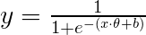

# Pattern Recognition Assignments 2: Classification
UVic Robotics Master. Pattern Recognition Homework 2

## Instructions

Clone this repository and write code to complete the assignments. When
executed, your code must print the answers to the questions in each
section, alongside the results that led to these conclusions. Module
*textwrap* can be used to format long paragraphs of text and make them
look nicer. An IPython notebook is an acceptable alternative to a
plain Python program.

This is a personal assignment, please complete it **individually**. 

# Datasets

For this class we will use several datasets:
- [Iris](https://archive.ics.uci.edu/ml/datasets/Iris): Very small dataset with three classes from the UCI repository (you will need to download the data and labels from there). Use the train/test partition indicated by the indexes 'iris_idx_train.txt' and 'iris_idx_test.txt' (you can use them for slicing).
- 3DClothing Dataset: This dataset contains a bag-of-words style representation of FINDDD descriptors extracted over a regular grid on 3D scans of different garments lying on a table. More information in: [Clothing Part Dataset](http://www.iri.upc.edu/groups/perception/#clothingDataset)
- [Jain](http://cs.joensuu.fi/sipu/datasets/jain.txt): Small dataset of 2-dimensional points.
- Robot Waiter: Classification scores for a robot waiter's vision system.  
   
In the "Campus Virtual" (Unitat 4->Activitats->Classification) you will find downloadables for the 3DClothing and the Robot Waiter datasets, as well as the train/test splits for the Iris dataset. Files with npy extension can be loaded with [numpy.load](http://docs.scipy.org/doc/numpy/reference/generated/numpy.load.html#numpy-load).

## K-Nearest Neighbors

- **Q1** Implement a function that does kNN classification, and use it
to classify the Iris dataset. Once you get a near-perfect
classification there, use your function in the 3DClothing
dataset. Plot the accuracy for all odd values of k from 1 to 9.  

 > Hint: the *cdist* function in SciPy may be helpful. 

## Logistic Regression

We will use *Scikit Learn* to train Logistic Regression classifiers
for the 3DClothing data. You may want to take a look at the
[documentation](http://scikit-learn.org/stable/modules/generated/sklearn.linear_model.LogisticRegression.html)
and examples.

- **Q2** First we will focus on a two-class problem. Use slicing to
get a new training and testing set that only contains the instances
corresponding to **shirt** and **jeans** (remember to also create
new *label* variables!). Then, train a Logistic Regression classifier,
adjusting the *C* parameter with cross-validation. This time you can
chose to use the
[cross-validation](http://scikit-learn.org/stable/modules/generated/sklearn.cross_validation.StratifiedKFold.html)
functions provided by sklearn. Plot the training and validation
accuracy as *C* is incresed, and print the test accuracy for the
selected model.

 > Let your *C* search range be from 10^-7 to 10^7.  
 > Hint: use log-scale for the *C* value in the plot.
 > Hint: Since we do not have a lot of training data, use 15
 > folds to ensure the train set will be large enough.
 
- **Q3** Now, train a multi-class Logistic Regression classifier with
the complete training set. Again, plot the training and validation
accuracy as *C* increases, and print the final test accuracy.  
 > Warning: the training time can be a bit long for large *C*s. If the 
 > training time gets too long, try reducing the max *C* value to 10^3.

- **Q4** Sometimes we want to re-use a trained classified in another
system, or with another programming language. Other times we just want
to save it to disk for later usage. Given a trained linear classifier
object, explain what information should we be saving in order to be
able to do so. Next, inspect the "shirts vs jeans" logistic
regression classifier object we have trained in Question 2 (re-train
it if necessary) and identify which variables contain said
information. Finally, write the code necessary to use these variables
to classify new test samples.  

 > Hint: In Python, you can see the methods and variables of an object
   with dir(*object*).  
 > Hint: Variables that start and end with two underscores, such as "\_\_dir\_\_" are internal Python object methods, not relevant for our problem.  
 > Hint: In sklearn, variables tend to have a underscore at the end, while functions have no underscores at the beginning/ending of the name.
 > Remember that the equation for Logistic Regression is:  
 >   

## Support Vector Machines

- **Q5** For this exercise we will be using the synthetic dataset
[jain](http://cs.joensuu.fi/sipu/datasets/jain.txt). This dataset has
only two dimensions, and therefore can be easily visualized. Train a
linear Support Vector Machine (*sklearn.svm.LinearSVC*) and a SVM with
a Gaussian Radial Basis Function Kernel (*sklearn.svm.SVC*) using the
*jain* data (randomly split it 50-50 for train/test). Then, use the
following Python function to visualize the decision boundaries of the two
classifiers. Describe what you see.  

 ```python  
  # Adapted from: Gael Varoquaux, Andreas Muller; "Classifier comparison"  
  # http://scikit-learn.org/stable/auto_examples/classification/plot_classifier_comparison.html  
  def paint_decision_functions(data, labels, clf):  
      from matplotlib.colors import ListedColormap  
      import pylab  
      cm = pylab.cm.RdBu  
      cm_bright = ListedColormap(['#FF0000', '#0000FF'])  
      x_min, x_max = data[:, 0].min() - .5, data[:, 0].max() + .5  
      y_min, y_max = data[:, 1].min() - .5, data[:, 1].max() + .5  
      xx, yy = np.meshgrid(np.arange(x_min, x_max, 0.1),  
                           np.arange(y_min, y_max, 0.1))  
      Z = clf.decision_function(np.c_[xx.ravel(), yy.ravel()])  
      Z = Z.reshape(xx.shape)  
      pylab.contourf(xx, yy, Z, cmap=cm, alpha=.8)  
      pylab.scatter(data[:, 0], data[:, 1], c=labels, cmap=cm_bright)  
      pylab.xlim(xx.min(), xx.max())  
      pylab.ylim(yy.min(), yy.max())  
      pylab.xticks(())  
      pylab.yticks(())  
      pylab.show()  
 ```  

- **Q6** We will now compare the performance of the linear and the RBF Support Vector Machines in a real dataset: Train the two classifiers in the *jeans* vs *shirts* problem from *Q2*, and compute the accuracy on the test set. What happened?    

 > **Warning: Spoilers next**
 > It turns out that in high-dimensional spaces, it is usually fairly
   easy to find a good separating hyperplane, and the much larger
   capacity of the non-linear classifiers may lead to overfitting.

- **Q7** Take a look at the variables **support_**,
**support_vectors_** and **dual_coef_** of the non-linear
classifier object for the *jeans* vs *shirts* problem trained in *Q6*. Explain what
they are.

## Classifier Evaluation
We have just finished developing the vision system of a robot waiter to work in a bar. Now we have to evaluate it. 

- **Q8** After developing a french fries image logistic regression classifier for our robot waiter, we want to know how good it is. We have run the image classifier in 150.000 images, of which 150 are positives. Load the probability of french fries computed by our classifier and the true labels, and compute:
 - Accuracy and Error Rate (assume threshold is at 0.5)
 - Balanced Error Rate (implies computing True Positive Rate, True Negative Rate)
 - F1-score (implies computing also precision and recall)  

    > Hint: Since we will consider the whole dataset, there is no need to sort the values.  

 - Since being a bit slower is prefearable to our robot attacking a client wearing stripes, we are more concerned about precision than recall. Compute the f-beta score with beta=0.5
 - Finally, plot the precision-recall curve for our classifier.  

   > Use the function [precision_recall_curve](http://scikit-learn.org/stable/modules/generated/sklearn.metrics.precision_recall_curve.html#sklearn-metrics-precision-recall-curve) found in sklearn.metrics.  

- **Q9** Now load all the classifier scores of our robot waiter's vision system, and compute a [confusion matrix](http://scikit-learn.org/stable/modules/generated/sklearn.metrics.confusion_matrix.html#sklearn-metrics-confusion-matrix) (take a look [here](https://en.wikipedia.org/wiki/Confusion_matrix) for a definition). Describe what you can observe in the matrix.  

  > You can plot the matrix using the following code:
  > ```python
   import pylab
   pylab.imshow(conf_matrix, interpolation='nearest')
   pylab.yticks(range(len(class_names)), class_names)
   pylab.xticks(range(len(class_names)), class_names)
   pylab.xticks(rotation=90)
   pylab.show()
   
## Extra

- The Scikit Learn webpage has some nice
[tutorials](http://scikit-learn.org/stable/tutorial/index.html) on
machine learning. If you want to learn more, consider completing some
or all of them.
